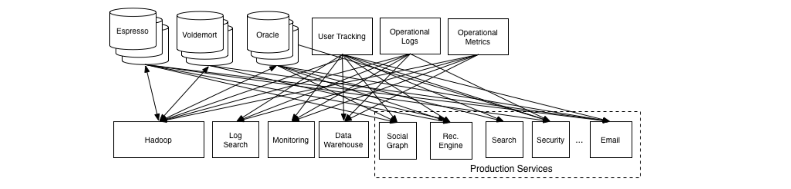
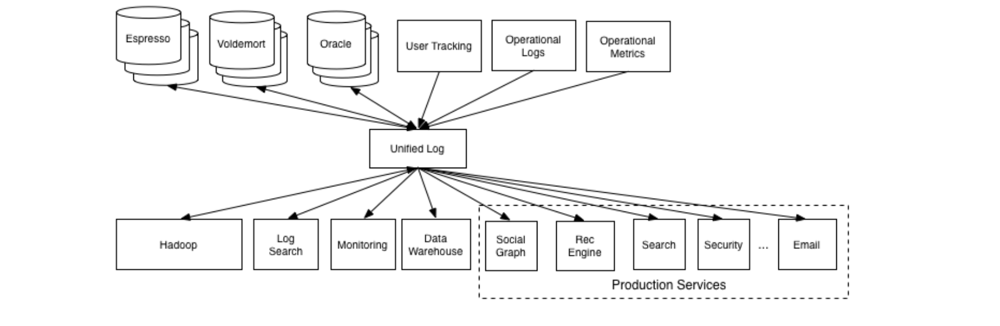
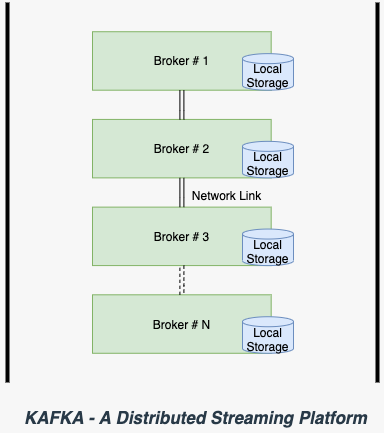
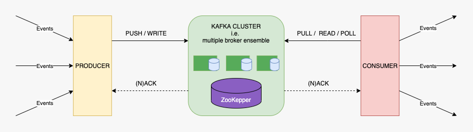
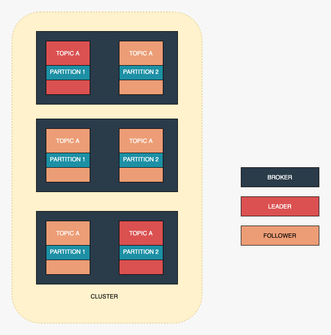
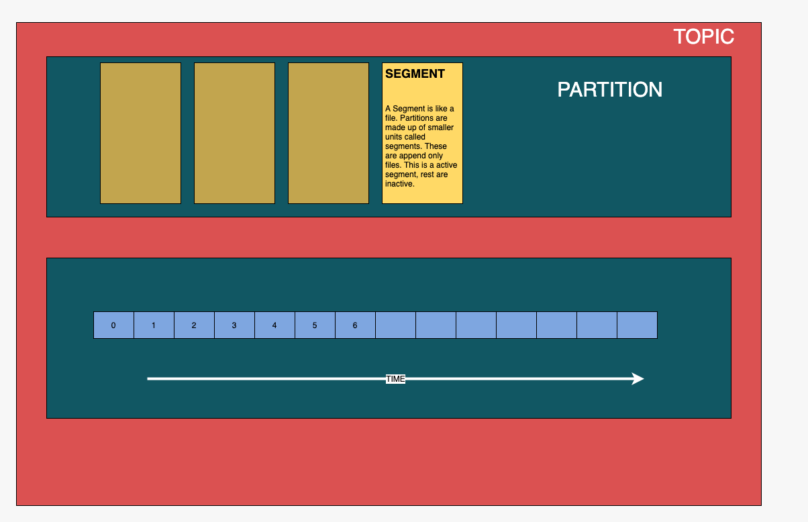
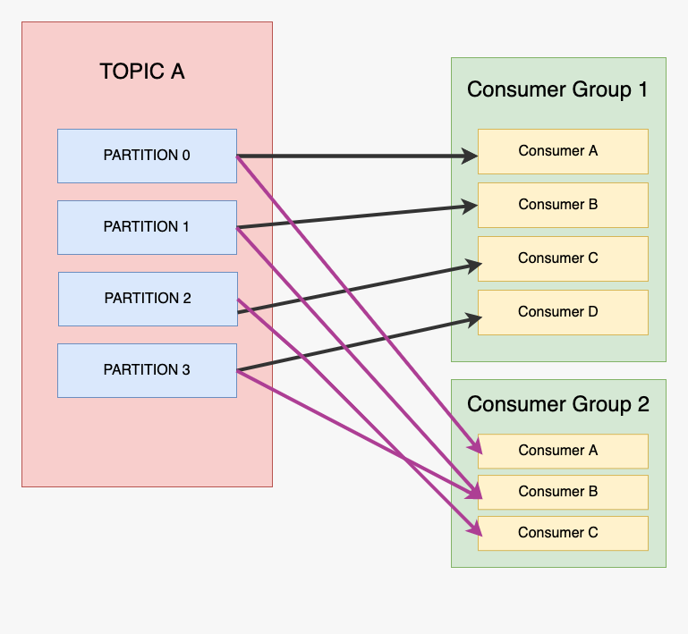

<h1><span style="color:hsl(0deg 0% 70%); text-transform: none;">Apache Kafka</span></h1> 
<h3><span style="color:hsl(0deg 0% 100%); text-transform: none;">An Introduction</span></h3> 

<div style="margin:150px 0;">
<p style="color:hsl(0deg 85% 50% / 90%)">Ravi S Tiwari</p>

[@devravitiwari](https://twitter.com/devravitiwari)
</div>

--h--

<h3 style="color:hsl(0deg 85% 50% / 90%); text-transform: none;">The Problem</h3>



--v--

- Everybody has to know everyone else
- Link setup more imp than message
- Not scalable - too many connections, tightly coupled

--h--


<h3 style="color:hsl(0deg 85% 50% / 90%); text-transform: none;">The Solution</h3> 
<em>(partial)</em>



--v--

<h3 style="color:hsl(0deg 85% 50% / 90%); text-transform: none;">The Solution</h3> 
<em>Build a Distributed System</em>




--h--

<h3 style="color:hsl(0deg 85% 50% / 90%); text-transform: none;"><em>How the solution looks</em></h3>



--v--

#### _Isn't what we were using earlier_

- Decoupled Pub-Sub systems
- Queueing solutions
  - RabbitMQ
  - ActiveMQ
  - MSMQ etc
- Hadoop and others

--v--
#### _Kafka is different_

- Push-Pull mechanism.
- Distributed at heart.
- Designed for real-time event processing.
- _Flowing [gently down the stream](https://www.gentlydownthe.stream/)_

--h--
### A bit under the hood

--h--
<h3 style="color:hsl(0deg 85% 50% / 90%); text-transform: none;">Topics</h3> 

- Messages are broadcasted against a topic. 
- Topics are stored across broker(s).
- Topic is an organizing grouping structure.
- Partition and replication are general concepts of distributed systems.
- Have leaders and followers.
- These are abstract entities.

--v--


--v--

- A grouping of similar events
- Like a directory
- No theoretical limit
- Retention policy set globally or per topic

--h--
<h3 style="color:hsl(0deg 85% 50% / 90%); text-transform: none;">Partitions</h3> 

- The physical entity against the abstraction of topics.
- AKA <span style="color: hsl(0deg 100% 50%)">_the log_</span>
- <em>Partitions</em> are spread across brokers.
- _Partitions_ handled by a partitioner (algo). 
- Can be equated to a file inside a directory
- Instead of one big file, have multiples called <span style="color: hsl(60deg 100% 50%)">_segments_</span> - this is too low level

--v--


--v--
- <span style="color: hsl(0deg 100% 50%)">Log</span> = Immutable record of things
- Only append-only
- Maintain _offsets_
- Consuming messages is reading messages - no deletion other than as by retention policy
- Multiple consumes can read a single partition - at different or same offsets

--h--
#### So how does consumption happens
_And what about the queueing problems with earlier solutions?_

--v--


--v--

- Consumption is pull rather than push
- Consumption is reading 
- [Zero-copy data transfer](https://developer.ibm.com/articles/j-zerocopy/) enables high throughput
- Even a single consumer resides inside a consumer group - a degenerate group


--h--

#### _This in a nutshell completes the picture_
 ...and how some of the parts of Kafka tie together.


--h--

### DEMO

--h--

#### Running in a local installation

_To setup and run locally, make sure your system has below :_ 
- Java 8 or higher installed
- Has Unix or Linux distro OS - It could be run on Windows, surely not without pain.


--v--

#### Instructions

- Download and install Kafka locally. 

- Pre build binaries are available.

- Assuming Kafka is installed and accessible from env variable `KAFKA_HOME`

```shell
set KAFKA_HOME=/usr/local/Cellar/kafka/2.8.0/libexec 
cd $KAFKA_HOME

``` 

- `bin` and `config` directories are under the `KAFKA_HOME` path.

--v--
1. Start the ZooKeeper service in a terminal session

```shell
$ bin/zookeeper-server-start.sh config/zookeeper.properties

```

--v--
2. Start the Kafka broker service, in another terminal session

```shell
$ bin/kafka-server-start.sh config/server.properties

```

--v--
3. Create topic to produce to

```shell
$ bin/kafka-topics.sh --create \
--topic marvel-heros \
--bootstrap-server localhost:9092

```

--v--
3.b Describe a topic to see partition details

```shell

$ bin/kafka-topics.sh --describe \
--topic marvel-heros \
--bootstrap-server localhost:9092

```
--v--
4. Produce to created topic. Press Ctrl-C to end

```shell
$ bin/kafka-console-producer.sh \
--topic marvel-heros \
--bootstrap-server localhost:9092

```
--v--
5. Consume produced messages

```shell
$ bin/kafka-console-consumer.sh \
--topic marvel-heros --from-beginning \
--bootstrap-server localhost:9092

```

--h--

#### Using a client lib for NodeJS

Follow the README instructions from the <span style="color: hsl(0deg 100% 50%)">code</span> directory.

--h--

### Thanks
Spread ❤️

_Stay curious, stay alive !_ ©
